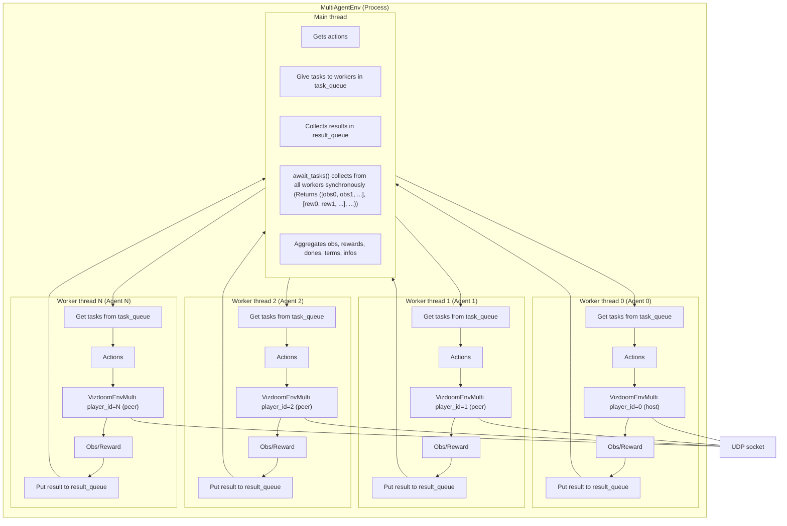

## This file

is only meant for architecture, data flow is in `step_and_onwards.md`

## High level flow

### Initialize stuff

1. Create MultiAgentEnv wrapper
2. Create N MultiAgentEnvWorkers (one per agent)
    + Each worker starts its own thread and waits for INIT task
3. Find available UDP port
4. Use FileLock to prevent simultaneous initialization
5. Send INIT task to all workers with port info
    + Worker 0 -> N init
6. Workers wait for all clients to connect, then game starts

### Reset, episode start

1. Send RESET task to all workers
2. Each worker calls env.reset() in its thread
    + game.new_episode() in VizDoom
    + Return first observation
3. Main thread collects observations from all workers (array of obs)

### Step, during training

1. Do frame skip from frames 0 to `i-2`
    + Send STEP task: Do actions but state not retrieved
    + Last frame `i-1`: Send STEP_UPDATE task: Do actions and gets obs, rewards, dones
2. Convert actions from gym action space to the action space expected by Doom game
3. Do `game.set_action(actions_binary)` and `game.advance_action(1, update_state)`
4. Main thread collects results (it uses `await_tasks()`, discussed below why this is synchronous and if we should make it async)
5. If all agents are done bases on episode terminate condition we set:
    + Auto reset
    + Store reset_info in info dict
6. Return (observations, rewards, terminated, truncated, infos)


## Workers threads

There are 8 task types: INIT, TERMINATE, RESET, STEP, STEP_UPDATE, INFO, SET_ATTR. These task types are what gets put into `task_queue`

We use queue for thread-safe communication without mutexes (locking).

Result collecting is synchronous (simple, no risk of errors), might make asynchronous for faster if more agents, but not sure if asyncing `queue.get()` might cause issues. I had an implementation of this using `asyncio` in `doom_multiagent_wrapper.py`

```python
def _ensure_initialized(self):
    self.workers = [MultiAgentEnvWorker(i, self.make_env_func, self.env_config, reset_on_init=self.reset_on_init) for i in range(self.num_agents)]
```




## Why we use FileLock instead of making semaphores?

```python
lock_file = doom_lock_file(max_parallel=20)
lock = FileLock(lock_file)
with lock.acquire(timeout=10):
```

We want different experiment runs respect the same lock, and locks automatically released if process dies. Also because vizdoom has race conditions during init when too many instances start at once.


## Why threading, not multiprocessing?

Threads share memory, so it avoids serialization overhead. Also, game instances communicate via UDP anyway, so process isolation isn't important. But multiprocessing is an option if we want better debugging. Debugging with thread is painful.