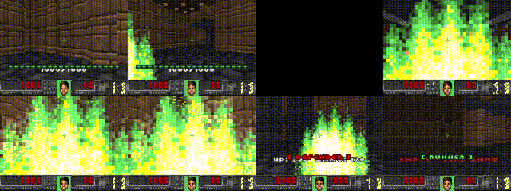

  <h1 class="text-8xl font-black tracking-tight text-white mb-6">COMRAD</h1>
  
Cooperative Multi-Agent Reinforcement Learning in Doom

  
A standardized benchmark for 3D cooperative AI

---

  <h1 class="text-5xl font-bold text-white mb-12">The Coordination Problem</h1>

  

    

      

        Single-agent: 
        You control everything. You see everything.
      

    

    

      

        Multi-agent: 
        Partial view. Must coordinate. Mistakes compound.
      

    

  

  

    Like moving a couch up stairs. Each person only sees their side.
  

  

    

      

        
      

      
Single agent: carries a box alone

    

    

      

        
      

      
Multi-agent: moving a couch up stairs

    

  

---

  <h1 class="text-5xl font-bold text-white mb-12">The Gap</h1>

  
Current multi-agent benchmarks use simplified 2D/3D worlds.

  

    

      
StarCraft (SMAC)

      
Top-down view, micromanagement

    

    

      
Google Research Football (GRF)

      
Physics-based 3D sports sim

    

    

      
Megaverse

      
High-speed 3D training (mainly single agent)

    

    

      
Overcooked / Gridworlds

      
Simple discrete coordination

    

  

  

    No standardized benchmark for 3D first-person cooperative AI exists.
  

---

  <h1 class="text-5xl font-bold text-white mb-12">COMRAD</h1>

  

    Moving MARL off the flat floor and up the stair.
  

  

    

      <h3 class="text-2xl font-bold text-white mb-3">First-Person 3D</h3>
      
Agents see what humans see: partial, egocentric observations

    

    

      <h3 class="text-2xl font-bold text-white mb-3">Standardized</h3>
      
Reproducible scenarios with baseline algorithms

    

    

      <h3 class="text-2xl font-bold text-white mb-3">High Throughput</h3>
      
>50,000 FPS -> rapid iteration and research progress

    

  

  

    Bridging the gap between toy benchmarks and real-world robotics.
  

---

  <h1 class="text-5xl font-bold text-white mb-8">Why It Matters</h1>

  

    

      
>50K

      
Frames per second

      
Train early morning, well-converged result by breakfast

    

    

      
13+

      
Benchmark scenarios

      
Reproducible, standardized tasks

    

    

      
7

      
Baseline algorithms

      
QMIX, MAPPO, HAPPO, + more

    

  

  

    
  

---

  <h1 class="text-4xl font-bold text-white mb-10">Scenario Design: Four Property Categories</h1>

  

    

      <h3 class="text-xl font-bold text-white mb-2">Game-Theoretic Properties</h3>
      

      
Social dilemmas, coordination games, asymmetric payoffs, Nash equilibria testing

    

    

      <h3 class="text-xl font-bold text-white mb-2">Game Design Properties</h3>
      

      
Role asymmetry, spatial constraints, resource scarcity, temporal pressure

    

    

      <h3 class="text-xl font-bold text-white mb-2">Reinforcement Learning Properties</h3>
      

      
Partial observability, credit assignment, sparse rewards, exploration challenges

    

    

      <h3 class="text-xl font-bold text-white mb-2">Emergent Behavior Properties</h3>
      

      
Role specialization, implicit communication, altruism, trust formation

    

  

  

    Each scenario is designed to stress-test specific combinations of these properties.
  

---

  <h1 class="text-4xl font-bold text-white mb-6">Scenario Examples</h1>

  

    

      <h4 class="font-bold text-white mb-2">Armory Siege</h4>
      
Defend core + fetch ammo runs

      
Role switching, temporal pressure

    

    

      <h4 class="font-bold text-white mb-2">Stag Hunt Arena</h4>
      
Hunt stag together or hare alone

      
Coordination dilemma, trust

    

    

      <h4 class="font-bold text-white mb-2">Stealth Labyrinth</h4>
      
Torch-holder + Gunner in darkness

      
Extreme Dec-POMDP, implicit comms

    

    

      <h4 class="font-bold text-white mb-2">Common Harvest</h4>
      
Harvest vs. maintain shared resource

      
Tragedy of the commons

    

    

      <h4 class="font-bold text-white mb-2">Lava Maze</h4>
      
Navigator + Spectator guidance

      
Asymmetric roles, partial obs

    

    

      <h4 class="font-bold text-white mb-2">Rhythm Sync</h4>
      
Simultaneous switch pressing

      
Temporal coordination, no comms

    

  

  

    13+ scenarios covering social dilemmas, role asymmetry, and implicit coordination
  

---

  <h1 class="text-4xl font-bold text-white mb-10">Procedural Generation: Non-Stationary Environments</h1>
  

    

      <h3 class="text-sm uppercase tracking-widest text-[#dee2e6] mb-3 border-b border-[#555] pb-2">Map Generation</h3>
      

        
Voronoi-based: Relaxed Voronoi cells -> rooms/corridors

        
Seedable: Fully deterministic for reproducible experiments

        
Batch Generation: Parameter sweeps create 100+ layout variants

      

    

    

      <h3 class="text-sm uppercase tracking-widest text-[#dee2e6] mb-3 border-b border-[#555] pb-2">Prevent Overfitting</h3>
      

        
Layout Variation: Different maze structures per seed

        
Runtime Reseeding: Environment shifts mid-episode

        
Parameter Grids: Distance, difficulty, timing all vary

      

    

  

  

    
Example: Armory Siege batch parameters:

    
distance: [600, 800, 1100] × corridor_width: [2, 4] × door_timer: [100, 350, 600] × ...

    
= 162 distinct environment configurations

  

---

  <h1 class="text-4xl font-bold text-white mb-6">Baseline Algorithms</h1>

  

    

      <h3 class="text-lg font-semibold text-[#dee2e6] mb-3">Value Decomposition</h3>
      

        

          IDQN
          Independent baseline
        

        

          QMIX
          Monotonic mixing
        

        

          VDN
          Additive decomposition
        

        

          QPLEX
          Duplex dueling
        

      

    

    

      <h3 class="text-lg font-semibold text-[#dee2e6] mb-3">Policy Gradient</h3>
      

        

          IPPO
          Independent baseline
        

        

          MAPPO
          Shared critic
        

        

          HAPPO
          Sequential updates
        

      

    

    

      <h3 class="text-lg font-semibold text-[#dee2e6] mb-3">Training Features</h3>
      

        

          Automated Curriculum
          
Progressive scenario difficulty

        

        

          Batch Training
          
Train across multiple scenario variants

        

      

    

  

  

    7 algorithms integrated with > 50,000 FPS on standard computer
  

---

  <h1 class="text-6xl font-bold text-white mb-6">COMRAD</h1>

  

    A standardized, procedurally-generated benchmark for studying cooperative emergent behaviors in 3D first-person environments.
  

  

    
13+ scenarios

    
4 behavior categories

    
7 baseline algorithms

    
>50K FPS

  

  
Any Questions?

